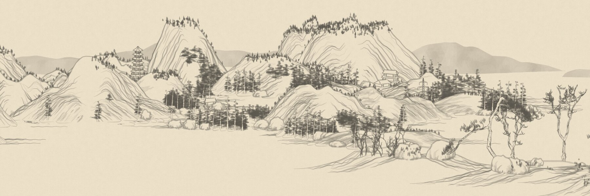
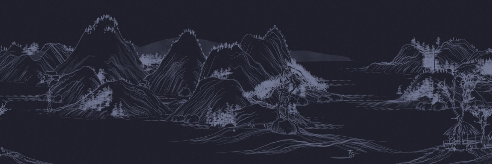

# shan-shui for Omarchy

An endless, slowly scrolling Chinese landscape painting (山水) as your
[Omarchy](https://omarchy.org) screensaver, drawn in your current theme's
colors.

**Install with one command** (on Omarchy, no Rust needed):

```sh
curl -fsSL https://raw.githubusercontent.com/yenst/shan-shui-omarchy/main/install.sh | bash
```

Then `omarchy-launch-screensaver force` to see it. Details are under
[Install](#install).





It is a Rust port of Lingdong Huang's wonderful
[shan-shui-inf](https://github.com/LingDong-/shan-shui-inf): mountains,
pine forests, pagodas, pavilions, fishermen in boats and the odd power-line
tower, generated forever as it scrolls. Your theme's foreground color becomes
the ink and its background the paper, so dark themes get light ink on dark
paper. It reads the theme each time it starts, so it follows your theme
changes.

You watch it being painted: the right side of the screen is blank paper, and
each mountain, tree and pavilion is drawn in stroke by stroke as it scrolls
in, the way the original paints it: outline, then hatching, then trees and
houses.

It also uses less power than the stock screensaver: about a quarter of the CPU
and half the memory on a 2880×1920 laptop screen.

## Install

On an Omarchy machine, run:

```sh
curl -fsSL https://raw.githubusercontent.com/yenst/shan-shui-omarchy/main/install.sh | bash
```

Then try it:

```sh
omarchy-launch-screensaver force
```

Move the mouse or press any key to close it.

That's it. From now on it starts whenever your screensaver would (after 2.5
minutes idle by default), and from **Menu → System → Screensaver**. It
downloads a prebuilt program from this repo's
[Releases](https://github.com/yenst/shan-shui-omarchy/releases), checks its
checksum, and installs everything into `~/.local/share/shan-shui`. No Rust
needed.

Rather read the script first? Clone the repo and run it from there; it does
the same thing:

```sh
git clone https://github.com/yenst/shan-shui-omarchy.git
cd shan-shui-omarchy
./install.sh
```

### Build from source

To compile it yourself instead of downloading, install Rust
(`omarchy install dev-env rust`, then open a new terminal) and run
`./install.sh --build` in a clone. The installer also falls back to this if
the download fails.

## Update

Run the install command again.

## Uninstall

```sh
rm -rf ~/.local/share/shan-shui
sed -i '/# >>> shan-shui screensaver >>>/,/# <<< shan-shui screensaver <<</d' ~/.bashrc
```

(Or `./uninstall.sh` from a clone, which does the same.)

## Tweaking

Edit `~/.local/share/shan-shui/bin/omarchy-launch-screensaver` and change the
default flags on the `read -ra extra` line (`--fps 20` out of the box). For
example `--fps 30 --speed 25` scrolls faster and smoother at a bit more CPU.
`shan-shui --help` lists everything:

```
--speed F         scroll speed (default 18)
--fps F           frame rate cap (default 30; the screensaver uses 20)
--zoom F          zoom out with values below 1 to see more landscape
--paper           the original's warm paper and black ink instead of your theme
--grain F         paper grain strength 0..1 (default 0.5)
--no-draw         show the painting finished instead of drawing it
--windowed        run in a normal window
--png PATH        render a single frame to an image
--version         print the installed version
```

Toggling the screensaver off in Omarchy (**Menu → Trigger → Toggle →
Screensaver**) still works.

## How it hooks into Omarchy

Omarchy's idle timer and menu start the screensaver by running
`omarchy-launch-screensaver` through `bash -lc`. `install.sh` installs a
replacement script with that name into `~/.local/share/shan-shui/bin` and puts
that folder first on your `PATH` in `~/.bashrc`, in a clearly marked block
(a backup is saved as `~/.bashrc.bak.shan-shui`). Nothing in Omarchy itself is
modified, so `omarchy update` won't undo it. If the shan-shui program is
missing, the script falls back to the stock screensaver.

The replacement opens one native fullscreen window per monitor, with the same
window class as the stock screensaver, so Omarchy's fullscreen rule and lock
timing apply unchanged. Typing `omarchy launch screensaver` (with spaces) still
starts the stock one, because that command bypasses `PATH`.

## Releases

Pushing a version tag (`git tag v0.3.0 && git push origin v0.3.0`) makes the
GitHub workflow in `.github/workflows/release.yml` build the program and
publish it with the launcher script as a release. The install command always
fetches the latest one.

## How it works

- `tree.rs`, `mount.rs`, `arch.rs`, `man.rs`, `scene.rs`: a close port of the
  original generators and its chunk planner. Each item gets its own random
  seed, so items are generated in parallel.
- `render.rs`: draws 512px-wide strips with
  [tiny-skia](https://github.com/RazrFalcon/tiny-skia) in grayscale, the way the
  original composes gray ink on white, then maps lightness onto the theme's
  ink-to-paper colors.
- `main.rs`: a [winit](https://github.com/rust-windowing/winit) +
  [softbuffer](https://github.com/rust-windowing/softbuffer) fullscreen window.
  A background thread generates the world and renders strips ahead of the
  scroll position, so scrolling is just copying finished images.

## License

MIT. The landscape generation is ported from
[shan-shui-inf](https://github.com/LingDong-/shan-shui-inf) by Lingdong Huang;
its license is in `LICENSE.shan-shui-inf`.
